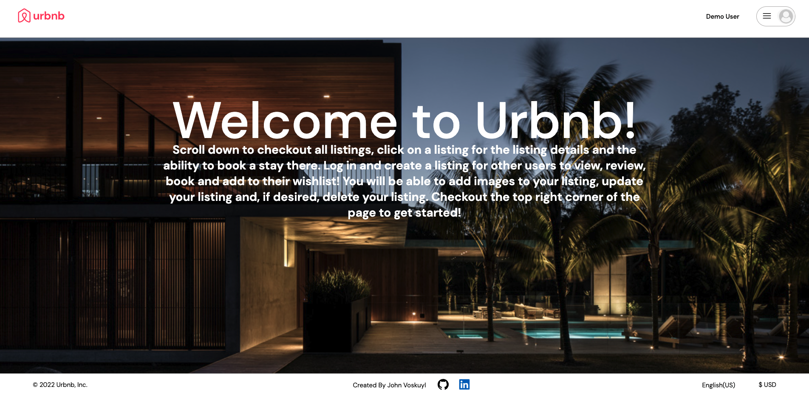

# Welcome to Urbnb! (an Aribnb clone)

-----------------------------------------------------------------------------------------------------

Welcome to Urbnb! Urbnb is a clone of Airbnb with limited funtionality at this time. On Urbnb you can post a listing anywhere in the world, no limitations and you can leave a review for listings. In the future the booking feature will be added along with other features.

This Airbnb clone was built using PostgreSQL, Flask, SQLAlchemy, React, Javascript, Redux and Python.

Checkout Urbnb and make it to an event near you at https://urbnb.onrender.com/

# Gibhub Wiki Links:

[Database Schema](https://github.com/jvos415/AirBnB-Clone/wiki/Database-Schema)

[Front End Routes](https://github.com/jvos415/AirBnB-Clone/wiki/Front-End-Routes)

[Wire Frames](https://github.com/jvos415/AirBnB-Clone/wiki/Wire-Frames)

[MVP Features List](https://github.com/jvos415/AirBnB-Clone/wiki/MVP-Feature-List)

[User Stories](https://github.com/jvos415/AirBnB-Clone/wiki/User-Stories)

# Splash Page

# Splash Page - Listings Section

# Listing Details Page - Images

# Listing Details Page - Booking and Reviews Section

# Manage Listings Page

# Trips Page - Bookings

# Wishlist

# Starting this app locally
** If you have an Apple with and M1 chip please skip to the next section

1. Clone this project from https://github.com/jvos415/AirBnB-Clone

2. Run pipenv install

3. Create a **.env** file based on the example with proper settings for your
   development environment

4. Setup your PostgreSQL user, password and database and make sure it matches your **.env** file

5. Get into your pipenv, migrate your database, seed your database, and run your flask app

   pipenv shell

   flask db upgrade

   flask seed all

   flask run

6. To run the React App in development, checkout the README inside of the `react-app` directory.

***
*IMPORTANT!*
   psycopg2-binary MUST remain a dev dependency because you can't install it on alpine-linux.
   There is a layer in the Dockerfile that will install psycopg2 (not binary) for you.
***

### Dev Containers (For M1 Users)
The following instructions detail an *optional* development setup for M1 Mac users having issues with the `psycopg` package.

1. Make sure you have the [Microsoft Remote - Containers](https://marketplace.visualstudio.com/items?itemName=ms-vscode-remote.remote-containers) extension installed. 
2. Make sure you have [Docker](https://www.docker.com/products/docker-desktop/) installed on your computer. 
3. Clone the repository

Clone this project from this repo from https://github.com/jvos415/AirBnB-Clone
 
4. Open the repo in VS Code. 
5. Click "Open in Container" when VS Code prompts to open container in the bottom right hand corner. 
6. **Be Patient!** The initial install will take a LONG time, it's building a container that has postgres preconfigured and even installing all your project dependencies. (For both flask and react!)

   **Note:** This will take much less time on future starts because everything will be cached.

7. Once everything is up, be sure to make a `.env` file based on `.env.example` in both the root directory and the *react-app* directory before running your app. You do not need a `DATABASE_URL` in the `.env` file if you are using this Docker setup for development - the URL is already set in the image (see `.devcontainer/Dockerfile` for the URL).

8. Get into your pipenv, migrate your database, seed your database, and run your flask app

   pipenv shell

   flask db upgrade

   flask seed all

   flask run

9. To run the front-end portion of this app, see the README located inside of the `react-app` directory.

 

# Future-To-Dos

* Ability to update bookings
* AWS for uploading listing images
* Ability to update images
* Search Bar
* Add avatar functionality
* Add the ability to upload your own avatar image
* Add the ability to create your own wishlists and add listings to specific wishlists
* Google maps for listing locations
